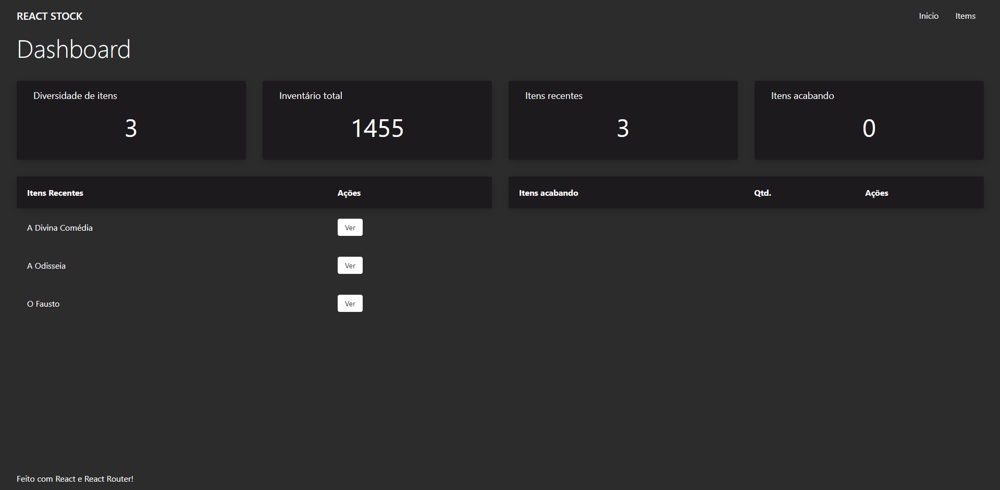
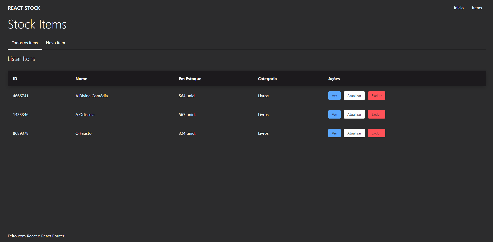
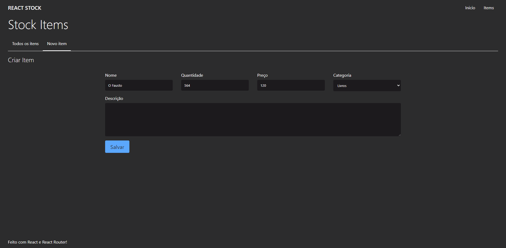
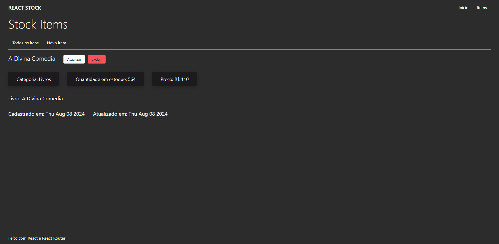
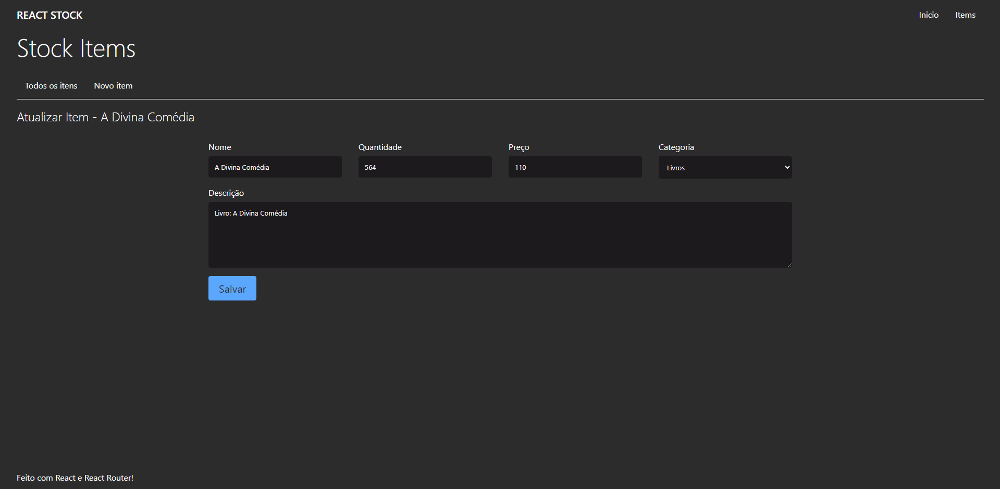

<h1 align="center">📦 React Stock — Sistema de Controle de Estoque</h1>

<p align="center">
  Um sistema de controle de estoque desenvolvido em React, com gerenciamento de dados no próprio frontend 🚀
</p>

---

### 📌 Tecnologias Utilizadas
<div>
  
  
  
</div>

---

### ✨ Funcionalidades

✔ Adicionar novos produtos  
✔ Listar produtos cadastrados  
✔ Atualizar informações (preço, quantidade, etc.)  
✔ Excluir produtos  
✔ Persistência simulada com classes JS (`entities/`)  
✔ Interface com React + Vite (rápida e responsiva)  

---

### 🖥️ Layout







---

### 🚀 Como executar o projeto

```bash
# Clonar repositório
git clone https://github.com/miguelfelipe09/react-stock.git

# Entrar no diretório do projeto
cd react-stock

# Instalar dependências
npm install

# Executar aplicação
npm run dev
```

---

👨‍💻 Autor

Miguel Felipe da Silva

📎 LinkedIn: https://www.linkedin.com/in/miguel-felipe-aab18523a/
